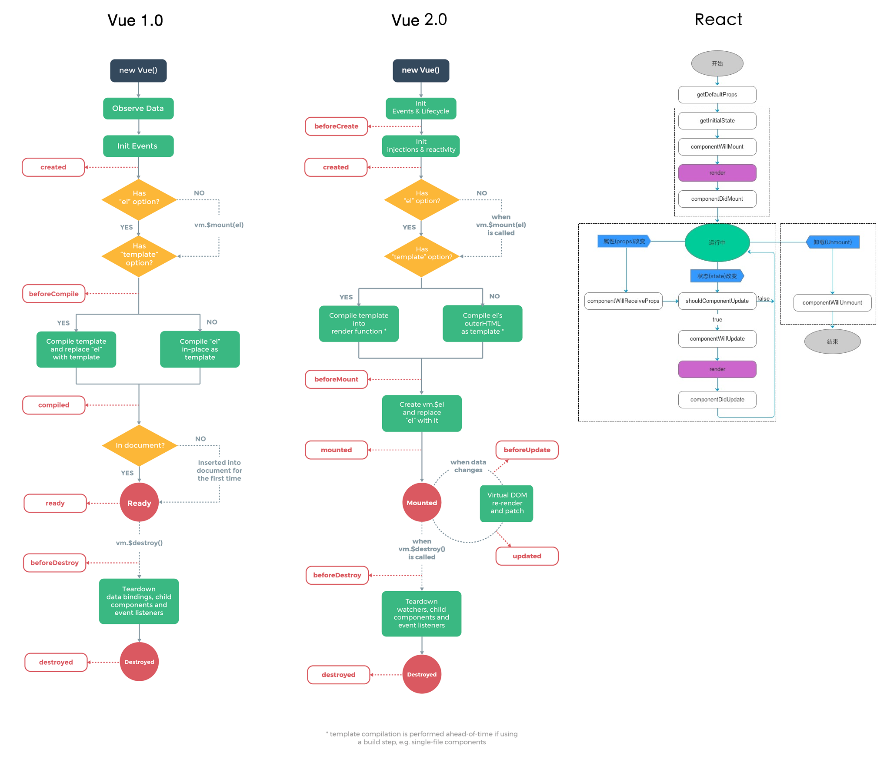

# Vue vs React

### 一、 组件与数据流
* **文件结构**
	* Vue：style标签 + template标签 + script标签
	* React：jsx / js

	
* **父子组件通信**
	* Vue：双向数据绑定，v-model来双向绑定变量
	* React：单向数据流，props传递数据到子组件，再通过props中的callback来回调父组件方法


#### Vue [代码示例](http://jsfiddle.net/wisteriaflash/b0a0m72c/)

```vue
<style lang="scss" src="demo.scss"></style>
<template>
  <h2>Todos:</h2>
  <ol>
    <li v-for="todo in todos">
      <label>
        <input type="checkbox"
          v-on:change="toggle(todo)"
          v-bind:checked="todo.done">

        <del v-if="todo.done">
          {{ todo.text }}
        </del>
        <span v-else>
          {{ todo.text }}
        </span>
      </label>
    </li>
  </ol>
</template>

<script>
export default {
  data: {
    todos: [
      { text: "Learn JavaScript", done: false },
      { text: "Learn Vue", done: false },
      { text: "Play around in JSFiddle", done: true },
      { text: "Build something awesome", done: true }
    ]
  },
  methods: {
  	toggle: function(todo){
    	todo.done = !todo.done
    }
  }
}
</script>
```

#### React [代码示例](https://jsfiddle.net/wisteriaflash/nc9qwy5L/)

```jsx
import React, { Component } from 'react';
import './demo.scss';

class TodoApp extends React.Component {
  constructor(props) {
    super(props)
    this.state = {
    	items: [
      	{ text: "Learn JavaScript", done: false },
        { text: "Learn React", done: false },
        { text: "Play around in JSFiddle", done: true },
        { text: "Build something awesome", done: true }
      ]
    }
  }
  
  toggleCheck(item) {
  	item.done = !item.done;
    this.setState({state: this.state});
  }
  
  render() {
    return (
      <div>
        <h2>Todos:</h2>
        <ol>
        {this.state.items.map(item => (
          <li key={item.id}>
            <label>
              <input type="checkbox" checked={item.done} onClick={() => {
              	this.toggleCheck(item);
              }} /> 
              <span className={item.done ? "done" : ""}>{item.text}</span>
            </label>
          </li>
        ))}
        </ol>
      </div>
    )
  }
}
```

### 二、 生命周期

### Vue1.0
* created
* beforeCompile
* compiled
* ready
* beforeDestroy
* destroyed

### Vue2.0
* beforeCreate
* created
* beforeMount
* mounted
* beforeDestroy
* destroyed

### React
* getDefaultProps
* getInitialState
* componentWillMount
* render
* componentDidMount
* componentWillReceiveProps
	* shouldComponentUpdate
	* componentWillUpdate
	* render
	* componentDidUpdate
* componentWillUnmount



### 三、 数据更新
#### Vue - $set [代码示例](https://jsfiddle.net/wisteriaflash/49n7g33f/)

```vue
<template>
<div id="app">
  <h2>{{title.name}}</h2>
  <p>tips:{{title.des}}</p>
</div>
</template>
<script>
export default {
  data: {
    title: {
    	name: 'ToDo -- a：'
    },
    /* title: {
      name: '',
      des: '',
    } */
  },
  ready(){
     /* this.title = {
      name: 'Todos',
      des: 'This is some todo list',
         } */
    this.title.name = 'ToDo -- b';
    this.title.des = 'This is some todo list';
    //this.$set('title', {name: 'ToDo -- c', des: 'This is some todo list'});
  },
}
</script>
```


#### React - setState [代码示例](https://jsfiddle.net/wisteriaflash/qsfe10gv/)
```jsx
class TodoApp extends React.Component {
  constructor(props) {
    super(props)
    this.state = {
    	items: [
      	{ text: "Learn JavaScript", done: false },
        { text: "Learn React", done: false },
        { text: "Play around in JSFiddle", done: true },
        { text: "Build something awesome", done: true }
      ]
    }
  }
  
  componentDidMount(){
  	setTimeout(() => {
    	this.setState({items: [{
      	text: 'change text', done: false
      }]});
    }, 2000);
  }
  
  render() {
    return (
      <div>
        <h2>Todos:</h2>
        <ol>
        {this.state.items.map(item => (
          <li key={item.id}>
            <label>
              <input type="checkbox" disabled readOnly checked={item.done} /> 
              <span className={item.done ? "done" : ""}>{item.text}</span>
            </label>
          </li>
        ))}
        </ol>
      </div>
    )
  }
}
```

### 四、模板与jsx
 * Vue: template是写在单文件组件中的，使用了基于 HTML 的模版语法
 * React: 放弃了模板而发明了JSX，通过render渲染方法，将 JSX + inline style + DOM写在了一起

#### Vue
```vue
<template>
<ol>
	<li v-for="todo in todos">
	  <label>
	    <input type="checkbox"
	      v-on:change="toggle(todo)"
	      v-bind:checked="todo.done">
	
	    <del v-if="todo.done">
	      {{ todo.text }}
	    </del>
	    <span v-else>
	      {{ todo.text }}
	    </span>
	  </label>
	</li>
</ol>
</template>
```

#### React
```jsx
render() {
    return (
      <div>
        <h2>Todos:</h2>
        <ol>
        {this.state.items.map(item => (
          <li key={item.id}>
            <label>
              <input type="checkbox" disabled readOnly checked={item.done} /> 
              <span className={item.done ? "done" : ""}>{item.text}</span>
            </label>
          </li>
        ))}
        </ol>
      </div>
    )
  }
```

### 五、监听数据变更
* Vue: `watch`
* React: `componentWillReceiveProps` - 属性更新

#### Vue


#### React


### 六、事件处理
* Vue: 通过emit派发事件，然后在父组件中监听事件
* React: 在props中配置事件的callback


### 七、列表渲染
* Vue: 使用v-for来渲染
* React: 使用map方法来渲染，注意绑定key值


### 八、过渡动画
* Vue：提供了`transition `的封装组件
* React：可以自行选择动画库，例如`react-transition-group`


### 其他 - 共同点
* 使用 Virtual DOM (Vue2.0)
* 提供了响应式（Reactive）和组件化（Composable）的视图组件。
* 将注意力集中保持在核心库，伴随于此，有配套的路由和负责处理全局状态管理的库。


  
### 组件演示：select

[示例](http://mo.jd.com/jdc/spirit/dist/#/page/components/select)

[ant-design](https://ant.design/components/select-cn/)
[element](http://element.eleme.io/#/zh-CN/component/select)


* 列表显示的方向动画：通过更改`transform-origin`来实现方向的变更
* 其他
